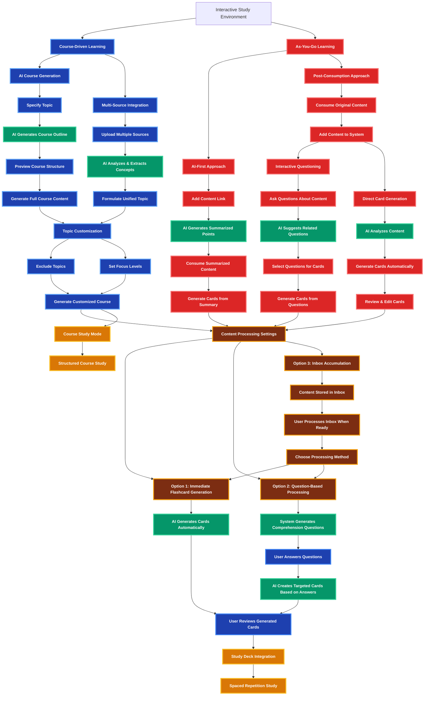

# Interactive Study Environment - Learning Flow Architecture

## Overview

This document outlines the two distinct learning approaches within the Interactive Study Environment: Course-Driven Learning and As-You-Go Learning.

## Learning Flow Diagram

## Key Components

### Course-Driven Learning
- **AI Course Generation**: Create complete courses from AI knowledge
- **Multi-Source Integration**: Combine materials from various sources
- **Topic Customization**: Control topic inclusion and focus levels

### As-You-Go Learning
- **AI-First Approach**: Consume summarized content directly
- **Post-Consumption Approach**: Process content after consumption
  - Interactive Questioning: Ask questions and generate cards
  - Direct Card Generation: Generate cards directly from content

### Content Processing Options
- **Immediate Generation**: AI creates flashcards automatically upon content arrival
- **Question-Based Processing**: System generates comprehension questions before card creation
- **Inbox Accumulation**: Content stored for batch processing when user is ready

### Integration Points
- **Study Deck Integration**: All generated cards flow into unified study system
- **Course Study Mode**: Structured progression through course content
- **Spaced Repetition**: Proven study technique for retention

## Data Flow

1. **Content Input**: Users provide topics, materials, or content links
2. **AI Processing**: Content analysis, summarization, and concept extraction
3. **User Interaction**: Customization, questioning, and curation
4. **Card Generation**: Creation of study materials from processed content
5. **Study Integration**: Seamless flow into learning and review systems
